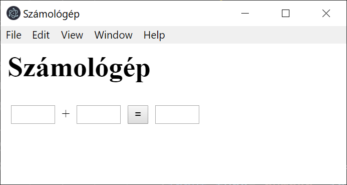

class: center, middle

# JavaScript alkalmazások 
# Kitekintés

---
# Adattárolás böngészőben

* Nincsen I/O API (nincsenek fájlok)
* Web API-k elérése (backend)
* Sütik (cookie)
* Web storage API
* ...

*(Adattárolás `Node JS`-en: van I/O API.)*

---
# Süti

Forgatókönyv: 
 1. A böngésző elküld egy HTTP kérést a szervernek. 
 1. A szerver a HTTP válaszban küld egy adatot (süti).
    * `Set-Cookie: <cookie-name>=<cookie-value>`
1. A böngésző eltárolja a sütit
1. Ha **ugyanennek** a szervernek küld újabb HTTP kérést a böngésző, beleteszi a sütit
    * `Cookie: <cookie-name>=<cookie-value>;`
1. A sütinek van egy lejárati ideje, ha lejár, a böngésző törli. 

Mire használjuk? 
    * Tipikusan bejelentkezési tokenek tárolására

---
# `document.cookie`

Ezen keresztül férünk hozzá a sütikhez:
* `let allCookies = document.cookie;`: összes süti kiolvasása
* `document.cookie = newCookie;`
    * `newCookie` egy string, formátuma: `key=value`
    * egy új süti kiírása (a régieket nem írja felül)
    * egy meglévő módosítása
    * a többit érintetlenül hagyja


* [sütikről részletesen](https://developer.mozilla.org/en-US/docs/Web/HTTP/Cookies)
* A sütik megtekinthetőek a *Developer tools/Application* tabon
* [`document.cookie`](https://developer.mozilla.org/en-US/docs/Web/API/Document/cookie)

---
# Web Storage API

* `sessionStorage`: az adott dokumentumhoz elérhető tárolóhely
    * kulcs-érték párok halmaza
    * a kulcsok, értékek string-ek (sorosítani kell az adatot)
    * maximalizált méret (pl. 10MB)
    * Amikor a tabot bezárjuk, a `sessionStorage` törlődik
    * Elérés: `sessionStorage` vagy `window.sessionStorage`
* `localeStorage`: ~`sessionStorage`, csak a tartalma nem törlődik, amikor bezárjuk a tabot

[Storage API](https://developer.mozilla.org/en-US/docs/Web/API/Web_Storage_API): 
 * `getItem(key)`
 * `setItem(key, value)`
 * `removeItem(key)`
 * `clear()`

---
# Web Storage API 2

```js
let userData = {
    name: 'XYZ',
    email: 'x@y.z'
};
localStorage.setItem("user", JSON.stringify(userData));

let userData2 = JSON.parse(localStorage.getItem("user"));
```

---

# Platformok

* JavaScript / TypeScript alkalmazások szerveroldalon: `Node JS`
* JavaScript / TypeScript grafikus felülettel rendelkező kliensalkalmazások: 
    * **Angular**
    * React
    * Vue JS
* JavaScript / TypeScript desktop alkalmazások
    * **Electron**: [https://electronjs.org/](https://electronjs.org/)
    * ~Apache Cordoba

---
# Electron

[https://electronjs.org/](https://electronjs.org/)

> If you can build a website, you can build a desktop app. Electron is a framework for creating native applications with web technologies like JavaScript, HTML, and CSS. It takes care of the hard parts so you can focus on the core of your application.

---
# Electron példa

`code\electron-js\index.html`: Példa Single Page Applciation JavaScript nyelven:

`package.json`:

```json
{
  "name": "electron-js",
  "version": "1.0.0",
  "main": "main.js",
  "devDependencies": {
    "electron": "^5.0.1"
  }
}
```

---
# Electron példa 2

`main.js`
```js
const { app, BrowserWindow } = require('electron')

function createWindow () {
  // Create the browser window.
  let win = new BrowserWindow({
    width: 800,
    height: 600,
    webPreferences: {
      nodeIntegration: true
    }
  })

  // and load the index.html of the app.
  win.loadFile('index.html')
}

app.on('ready', createWindow)
```
---
# Electron példa 3

Futtatás
```console
$ npm install electron -g
$ electron .
```




